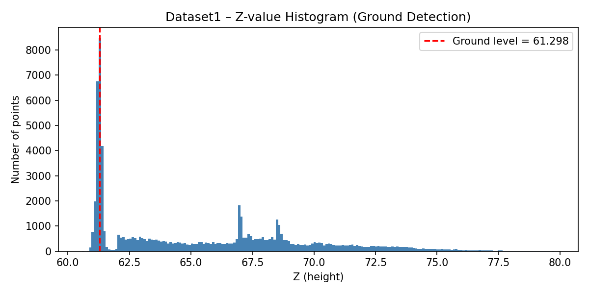
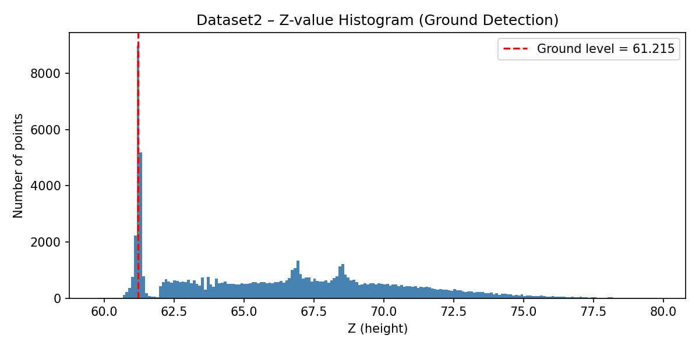
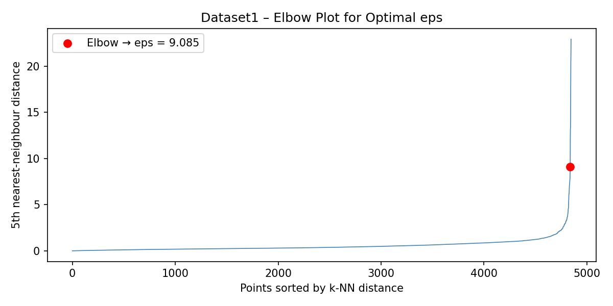
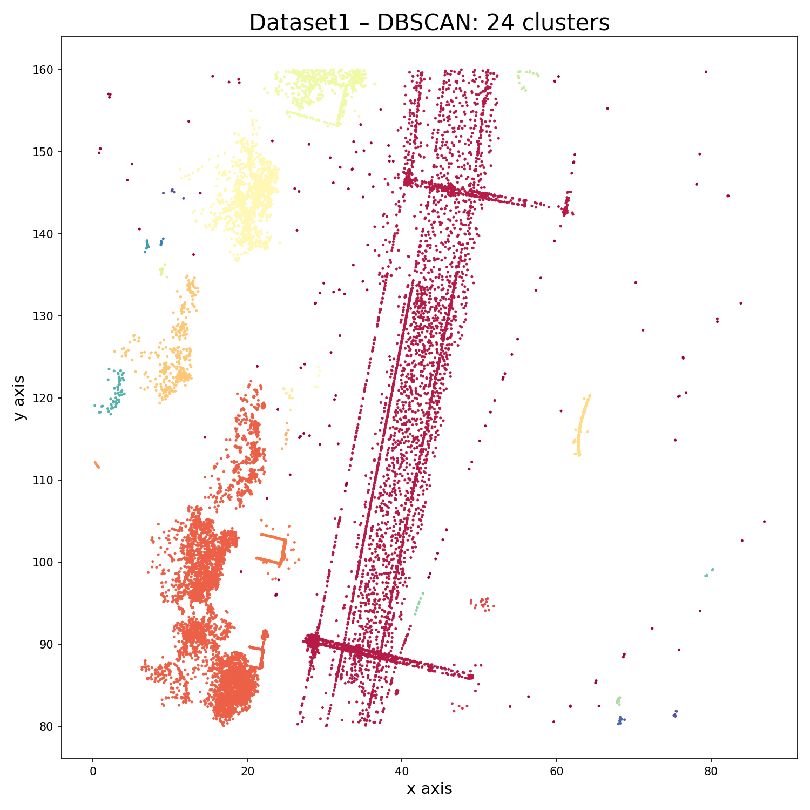
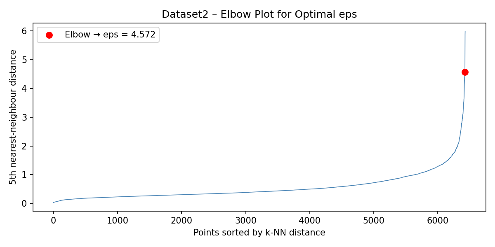
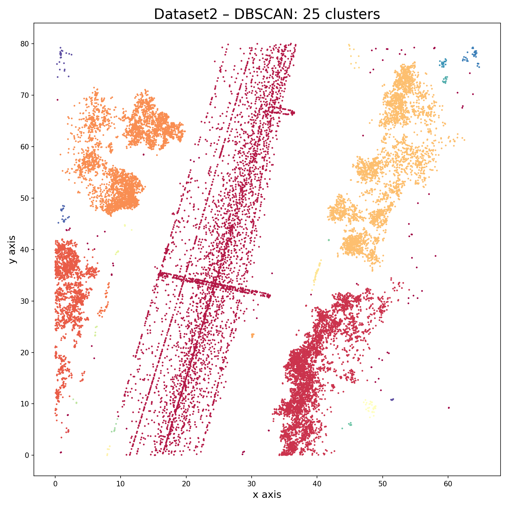
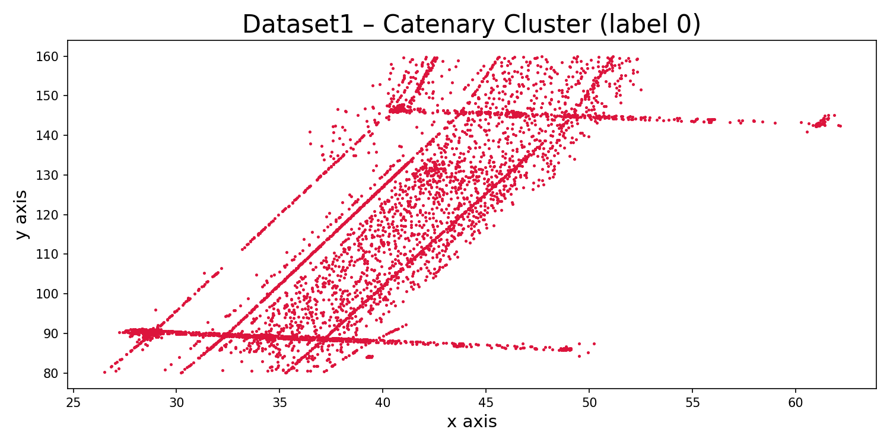
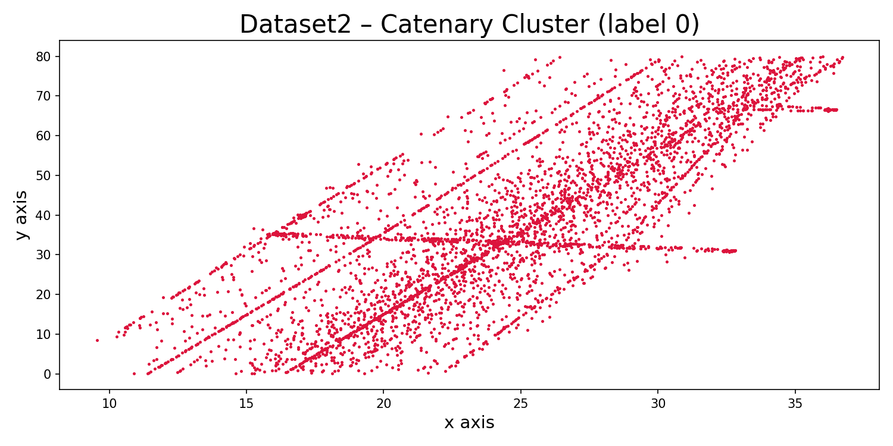

# Assignment 5 – LiDAR Point Cloud Processing

## Overview
This project processes LiDAR point cloud data from two railway datasets.
The tasks involve ground level detection, DBSCAN clustering with optimised
epsilon, and identification of the catenary (overhead wire) cluster.

---

## Task 1 – Ground Level Detection

The ground level was estimated by computing a histogram of all Z (height)
values. The bin with the highest point count corresponds to the ground plane,
since flat ground reflects the majority of LiDAR pulses in a railway scene.

| Dataset   | Ground Level (Z) |
|-----------|-----------------|
| Dataset 1 | 61.2977         |
| Dataset 2 | 61.2153         |

### Dataset 1 – Z Histogram

### Dataset 2 – Z Histogram

---

## Task 2 – Optimal eps and DBSCAN Clustering

The optimal eps value was found using the k-nearest-neighbour elbow method.
The distance to each point's 5th nearest neighbour is computed, sorted, and
plotted. The point of maximum curvature (the elbow) marks a good eps value.
DBSCAN was then applied with eps = 1.5, which produced the most physically
meaningful number of clusters.

| Dataset   | Elbow eps | eps used | Clusters found |
|-----------|-----------|----------|---------------|
| Dataset 1 | 9.085     | 1.5      | 24            |
| Dataset 2 | 4.572     | 1.5      | 25            |

### Dataset 1 – Elbow Plot

### Dataset 1 – Cluster Plot

### Dataset 2 – Elbow Plot

### Dataset 2 – Cluster Plot

---

## Task 3 – Catenary Cluster Identification

The catenary (overhead contact wire) runs continuously along the full length
of the railway track. Its cluster therefore has the largest maximum XY span
among all clusters. The noise cluster (label -1) was excluded from this
comparison.

| Dataset   | Cluster Label | min(x) | max(x) | min(y) | max(y)  |
|-----------|--------------|--------|--------|--------|---------|
| Dataset 1 | 0            | 26.498 | 62.140 | 80.019 | 159.977 |
| Dataset 2 | 0            | 9.550  | 36.719 | 0.030  | 79.993  |

### Dataset 1 – Catenary Cluster

### Dataset 2 – Catenary Cluster

